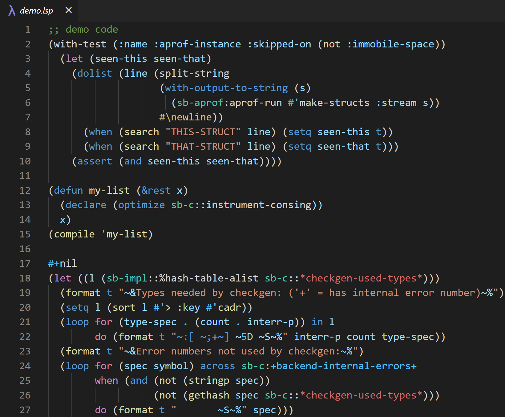

# Common Lisp TmLanguage
This repository contains TmLanguage files for [Common Lisp](https://common-lisp.net/), which describes [TextMate Grammars](https://macromates.com/manual/en/language_grammars), can be used by VSCode, TextMate, Sublime Text, and Atom.  

The TmLanguage files can tell the editors how to highlight code.

## Development

### Setup  
Run `npm install`  

### TmLanguage Files
We have two syntax files in `./syntaxes`, and we use `./syntaxes/scripts/build_grammar.mjs` (`npm run bg`) to convert them into `json` format:
- [`commonlisp.yaml`](./syntaxes.commonlisp.yaml) is the main syntax of Common Lisp.
- [`cl_codeblock.yaml`](./syntaxes.cl_codeblock.yaml) is the [injection grammar](https://code.visualstudio.com/api/language-extensions/syntax-highlight-guide#injection-grammars) for Markdown.

If you need to modify the syntax, here are some helpful materials:  
[Syntax Highlight Guide](https://code.visualstudio.com/api/language-extensions/syntax-highlight-guide),
[TextMate grammars](https://macromates.com/manual/en/language_grammars),
[making_language_grammar](https://gist.github.com/Aerijo/b8c82d647db783187804e86fa0a604a1#file-making_language_grammar-md),
[textmatebundle](https://www.apeth.com/nonblog/stories/textmatebundle.html),
[regex101](https://regex101.com/),
[Common Lisp HyperSpec](https://www.lispworks.com/documentation/HyperSpec/Front/).

### Editing Grammar Workflow
Mastering the TextMate grammars is very difficult. If you are a beginner, you can try to start with a small work sample and then work on it incrementally.  
The recommended workflow is:  
1. `git add`
2. construct a regex and verify the regex in [regex101](https://regex101.com/)
3. add the regex to the syntax
4. convert the syntax into `json` and test the syntax in real world

If you would like to test the highlighting in a VS Code extension, replace the file [commonlisp.tmLanguage.json](https://github.com/qingpeng9802/vscode-common-lisp/blob/df28fe2027baeb41414d3f0b7024e653031b2b79/syntaxes/commonlisp.tmLanguage.json) in the extension with the one you rebuilt.

### Maintain Grammar Health
```shell
npm run bg # After you modified the grammar, you need to rebuild the grammar. 
npm run testg # Then, test the grammar with the fixtures in `syntaxes/fixtures/baselines`.
npm run diff # Check if it is the test result you expected. Find the differences between the baselines and generated.
npm run accept # If the changes are what you expect, accept the new baselines.
```
> You may need to run `npx tsc -p syntaxes/scripts/tsconfig.json` to generate `gen_record.mjs` before `npm run testg`.

### Linting
Run `npm run lint` for linting.  
Most errors and warnings can be fixed automatically by running `npm run lint -- --fix`. 

Run `npx unimported` to check if there are any dangling files.

## Distribution
- GitHub [Linguist](https://github.com/github-linguist/linguist)

Note that althought this grammar is based on [vscode-common-lisp](https://github.com/qingpeng9802/vscode-common-lisp). This grammar has no version/source control relationship  with [vscode-common-lisp](https://github.com/qingpeng9802/vscode-common-lisp), and this grammar is intentionally separated.
## Highlighting Sample


## Acknowledgment
[CL-ANSI Standard Draft](https://franz.com/support/documentation/cl-ansi-standard-draft-w-sidebar.pdf),
[Common Lisp HyperSpec](https://www.lispworks.com/documentation/HyperSpec/Front/),
[vscode-scheme](https://github.com/sjhuangx/vscode-scheme),
[Scheme.tmLanguage](https://github.com/egrachev/sublime-scheme/blob/master/Scheme.tmLanguage),
[Lisp.tmLanguage](https://github.com/bradrobertson/sublime-packages/blob/master/Lisp/Lisp.tmLanguage),
[regex101](https://regex101.com/)

### Image Credits
The code segment in `Syntax Highlighting` is from [SBCL Repository](https://github.com/sbcl/sbcl).  
